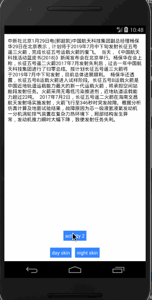

# chameleon
Android Change Skin,  Android Night Mode, 安卓换肤，安卓夜间模式

方便的话给个star! ️✨



## 如何使用

### 1、皮肤资源组织形式

框架中的皮肤是以主题的形式存在的，在 values 目录下建立 skins.xml，文件内容如下样例：

```<resources>

        <!--定义皮肤的全部属性，例如全局的背景色，全局的字体色等-->
       <declare-styleable name="skin_attr">
           <attr name="main_bg" format="color|reference"></attr>
           <attr name="button_bg" format="color|reference"></attr>
           <attr name="button_text_color" format="color|reference"></attr>
           <attr name="text_color" format="color|reference"></attr>
           <attr name="line_color" format="color|reference"></attr>
       </declare-styleable>

       <!--定义皮肤主题，给皮肤的属性赋值-->
       <!--白天皮肤-->
       <style name="AppTheme" parent="android:Theme.Light.NoTitleBar">
           <item name="main_bg">@color/main_bg</item>
           <item name="button_bg">@color/button_bg</item>
           <item name="button_text_color">@color/button_text_color</item>
           <item name="text_color">@color/text_color</item>
           <item name="line_color">@color/line_color</item>
       </style>

       <!--夜间皮肤-->
       <style name="AppNightTheme" parent="android:Theme.Light.NoTitleBar">
           <item name="main_bg">@color/night_main_bg</item>
           <item name="button_bg">@color/night_button_bg</item>
           <item name="button_text_color">@color/night_button_text_color</item>
           <item name="text_color">@color/night_text_color</item>
           <item name="line_color">@color/night_line_color</item>
       </style>

   </resources>
```

如果某个控件需要换肤，则该控件的一些属性的值必须引用皮肤属性，例如：

```
<LinearLayout xmlns:android="http://schemas.android.com/apk/res/android"
       xmlns:app="http://schemas.android.com/apk/res-auto"
       android:layout_width="match_parent"
       android:layout_height="match_parent"
       android:orientation="vertical"
       android:background="?attr/main_bg">
       <TextView
                    android:layout_width="match_parent"
                    android:layout_height="wrap_content"
                    android:textColor="?attr/text_color" />
</LinearLayout>

```

### 2、接入 SDK

将 lib 项目的代码引入到自己的项目中。

Application 初始化：

```
public class MyApplication extends Application {

    @Override
    public void onCreate() {
        super.onCreate();
        //设置当前皮肤
        SkinEngine.getInstance().changeSkin(R.style.AppTheme);
    }
}
```

Activity 改造：

目的是替换 LayoutInflater 的获取，可以将自己项目的 Activity 统一继承框架的 SkinActivity。
如果不能以继承的形式，则需将 SkinActivity 内部的代码拷贝到自己项目相应的类中。

```
package com.zxy.skin.sdk;


import android.content.Context;
import android.support.v4.app.FragmentActivity;
import android.view.LayoutInflater;


/**
 * @Description: 使用方可以继承该Activity，或者将内部代码拷贝到自定义的Activity
 * @author: zhaoxuyang
 * @Date: 2019/1/31
 */
public class SkinActivity extends FragmentActivity {

    private SkinLayoutInflater mLayoutInfalter;

    @Override
    protected void onCreate(@Nullable Bundle savedInstanceState) {
        super.onCreate(savedInstanceState);
        if(mLayoutInfalter==null){
            getLayoutInflater();
        }
        mLayoutInfalter.applyCurrentSkin();
    }

    @Override
    public final LayoutInflater getLayoutInflater() {
        if (mLayoutInfalter == null) {
            mLayoutInfalter = new SkinLayoutInflater(this);
        }
        return mLayoutInfalter;
    }

    @Override
    public final Object getSystemService(String name) {
        if (Context.LAYOUT_INFLATER_SERVICE.equals(name)) {
            if (mLayoutInfalter == null) {
                mLayoutInfalter = new SkinLayoutInflater(this);
            }
            return mLayoutInfalter;
        }
        return super.getSystemService(name);
    }

}

```

### 3、扩展 SkinApplicator

lib 项目中只写了 SkinViewApplicator 和 SkinTextViewApplicator ，支持 backgroud， textColor
等属性的换肤操作，其他属性的 Applicator 编写可以参照这两个以及样例中的 SkinCustomViewApplicator。
新增的 Applicator 需要注册到框架中。

```
public class MyApplication extends Application {

    @Override
    public void onCreate() {
        super.onCreate();
        SkinEngine.getInstance().changeSkin(R.style.AppTheme);
        SkinApplicatorManager.register(CustomView.class, new SkinCustomViewApplicator());
    }
}
```

## TODO

1、Applicator annotation processer

2、对通过代码创建的控件，提供换肤操作